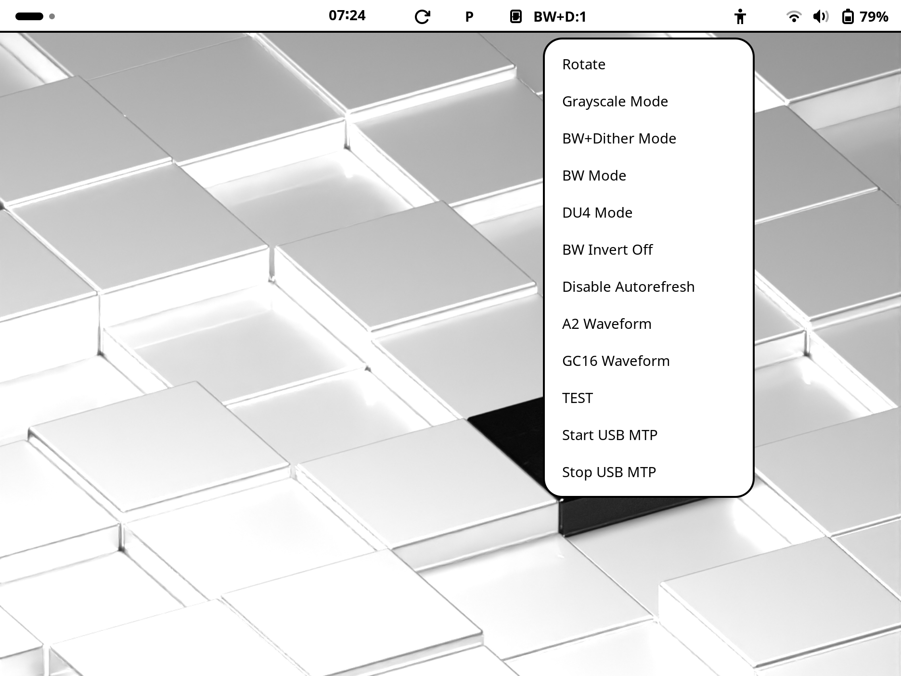

# Getting Started with the PineNote

<!-- First point of contact, should give just enough to know whats what and
setup someone who has used Linux before -->

Welcome to your new PineNote, we hope you enjoy the experience of using the
PineNote.
The PineNote comes loaded with a community maintained Debian based distribution
that has been pre-configured for a reasonable starting point.
Of course, you are welcome to customise your device to suit _you_.

In general, if things are unclear, please take the following actions:

* Read through this handbook (including the other sections)
* Refer to the [PineNote wiki page](https://wiki.pine64.org/index.php?title=PineNote)
* Try the PineNote chat (see [this wiki
  page](https://wiki.pine64.org/wiki/Main_Page#Chat_Platforms) for more
  information on how to connect).

!!! info

	Please read this document completely, as it will provide you with lots of
	relevant information pertaining to the proper use of your PineNote!

## Introduction

The Pinenote Debian system is a lightly-modified [Debian
trixie](https://www.debian.org/) installation, running GNOME as the graphical
user interface.
Usage should be fairly self explanatory, but there is a new menu
in the top bar of gnome that controls the ePaper (eink) display.
The display can render high quality greyscale, but due to the technology this
makes screen updates slower, as the screen does more refreshes and flickering.
This menu allows rapidly changing mode to suit what you are doing on the
device.

The screen features a Wacom digitiser for the pen input, and this is supported
out of the box.

## Help, my PineNote is not responding!

* The usual first step is to reboot the device. If the system itself is not
  responding anymore, try turning the PineNote off.
  This is accomplished by holding the PWR Button 10-12 seconds. After that, you
  can normally start your device using a short press of the button (1-2
  seconds).

## IMPORTANT ! Store your individual VCOM voltage now!

Each eink (ebc) panel must be operated with a specific biasing voltage, the
so-called VCOM voltage. At this point, we do not have the capabilities to
measure this voltage on a given PineNote.
Therefore, it is important to read out the factory-set vcom voltage once and
note it down.
You probably won't need it in the future, but this could be relevant in case
you manage to overwrite the provided u-boot boot loader and accidently flash a
boot loader that overwrites the VCOM voltage.

You can ready out the vcom voltage by executing the following command in a
shell (either in GNOME, using the UART console, or via ssh):

	cat /sys/module/tps65185_regulator/drivers/i2c\:tps65185/3-0068/regulator/regulator.29/microvolts

!!!info

	The community is still gaining experience with actually-observed VCOM
	values. We would appreciate it very much if you would be willing to share
	your VCOM values in the PineNote chat!

!!!info

	Efforts are ongoing to create linux drivers that allow (re-)measurement of the
	VCOM voltage. Ask the chat for more information.

### WiFi & Bluetooth

The PineNote can be connected to WiFi by using the menu in the top right hand
corner, and then tapping on the WiFi symbol.
Bluetooth also works as expected and shows up in this menu. This will allow you
to pair keyboards and other peripherals to the device.

Please keep in mind that the PineNote uses the same WIFI+Bluetooth combo also
found in various Raspberry Pi devices and shares some of the peculiarities of
this devices.
The most important thing to remember is that WIFI and BT share one antenna.
Moving Wifi over to a 5 Ghz network can not only improve WIFI experience in
congested areas for the PineNote, but can also drastically improve Bluetooth
quality.

### Updates

<!-- TODO -->
As the current operating system is Debian, the command line update tool is
`apt` but also the GUI program "Software" can be used to pull updates.
Where possible the OS is kept as close to upstream Debian, so everything should
feel about the same.

Please note that the PineNote comes with a custom package repository
pre-configured
This repository provides PineNote-specific packages, as well as a few patched
Debian packages that are useful/required for a smooth user experience.
The system is configured to prioritise this custom repository and will not
upgrade packages found in this repository with stock packages from the main
repository (this is called 'pinning').
This setup ensures improved working reliability of your PineNote, as the custom
repository is purely community maintained. While waiting for PN-specific
patches, we would not want stock packages to break the PN experience!

### ePaper Modes

ePaper displays work differently than traditional lcds.
Summarizing, these displays change their content by applying different voltage
waveforms to individual pixels, resulting in different shades of gray.
Problematic is that these waveforms differ depending on current temperature and
current state (color) of a given pixel.
In general, updating these displays is slow (complete screen updates can take
seconds!).

However, different waveforms have been developed by the panel manufacturers to
improve response times.
However, speed is bought at the expensive of quality, and fast waveforms
exhibit artifacts (remnants of previous images), or can only operate on a
limited color subspace (i.e., only for black and white pixels).

In daily operation of the PineNote, you will most probably only encounter three
waveforms:

* GC16: This is the default, high-quality waveform that enables 16 grayscale
  colors. It's also the slowest refresh type.
* DU4: This is a somewhat faster waveform, good for reading. It supports only 4
  colors.
* A2: This is a very fast black & white waveform, useful for fast changes of
  screen content  (i.e., drawing, writing).

One additional feature of the hardware is partial refresh capability: The
display can only be updated in a certain, rectangular region. This can greatly
improve response times, but requires adapted software.

The default Gnome environment comes with a simple extension installed that lets
you change the current panel waveform (as well as enable dithering for the
black and white mode).

* Use the "Grayscale" mode for high-quality, slow-changing content
* Use the "BW+Dither" mode for fast-changing, dithered black and white,
  content. Dithering refers to the representation of colors by using certain
  black & white pixel patterns. See the [corresponding Wikipedia
  page](https://en.wikipedia.org/wiki/Dither) for more information.
* Use the DU4 mode for a four-color representation. This is a good choice for
  reading books, or slow internet browsing.

!!! info

	Please take note of the "screen refresh" button right next to the system
	clock (the circling arrow). Pressing this button will trigger a screen
	refresh with the G16 waveform.

#### Performance and Quality modes

Apart from the selected waveform, another factor controls the speed of screen
refreshes: How fast a given waveform is applied to the panel.
A waveform basically consists of a sequence of excitation states (i.e.,
excitation voltages, plus, neutral, minus) that need to be applied to each
pixel of the panel in order to achieve a certain grayscale color of that pixel.

The speed of waveform application is controlled by one of the system clocks.
The current configuration allows us to switch between two clock speeds for this
specific clock, resulting in slower or faster application of the waveform.
The downside of the fast waveform is that, under non-specified conditions,
visual artifacts were observed.

In order to alleviate these visual issues, switching between those frequencies
was implemented, denoted as Quality mode and as Performance mode.
Additionally, the quality mode reconfigures GNOME to send screen updates at a
slower rate, further reducing the stress on the system, and therefore the
possibility for visual glitches.

You can switch between both modes by tapping the P (or Q) character in the top
panel of GNOME.

!!! info

	It is advised to cycle to Q mode and back to P mode before drawing, as the
	Gnome extension is not (yet) optimized with regard to making sure a given
	performance state is really in effect!

Please refer to the user-guide section for further, detailed, information on
the ebc panel and driver.

### Touch Gestures in Debian

Gnome comes with some touch gestures built in. Please refer to the linked help
page from Gnome for detailed information.
However, the most important gesture is bringing up the On-Screen Keyboard (OSK)
by swiping two fingers from the button screen border upwards.

[Gnome Online Help](https://help.gnome.org/users/gnome-help/stable/touchscreen-gestures.html.en)

### Thank you

The PineNote, among with its current software ecosystem, is the result of
multiple years of work from quite a lot of people. Notable mentions:

* A **lot** of driver development work was done by Samuel Holland (smaeul) and
  pgwipeout, as well as CrystalGamma
* Special note should be taken of the reverse engineering and development work
  of the EBC driver: Samuel Holland (smaeul), Ralimtek
* Early installation guides from Dorian and Martyn imensly helped to get people
  running Linux!
* early contributors include veapon, DorianRudolph, 0cc4m / occam_razor,
  UniversalSuperBox, counterpillow and caleb, iMartyn, danct12
* doc/wiki contributions by funeral, aarondabomb
* talkpadk provided us with a nice, curated, repo of the upstream u-boot
  (https://github.com/talpadk/u-boot-pinenote), upon which the currently-used
  u-boot version is built upon (https://github.com/talpadk/u-boot-pinenote).
* Eugen Răhăian created the first, initial version of the Debian image using
  *debos* (https://salsa.debian.org/eugenrh/pinenote-debian-recipes).
  This version was then extended to include the GNOME interface by
  Maximilian Weigand (https://github.com/PNDeb/pinenote-debian-image).
* Eugen Răhăian also did a lot of (destructive) testing of the screen
  components with regard to UV exposure.
* MichiMolle created a beautiful GNOME and GTK theme for the Pinenote
  (https://github.com/MichiMolle/PNEink)
* Cover designs by Funeral (https://wiki.pine64.org/wiki/PineNote_Press)
* Dragan Simic contributions include help with designing the PineNote's UART
  debug hardware
* User hrdl contributed on the drawing/input side:
	* optimised xournal++ for drawing performance
	* some fixes related to stylus input and touch in libinput / gtk / sway
	* 10 finger support and configurability for anyone who dares to replace
	  their touch screen controller's firmware (non-mainlined)
	  (https://gitlab.com/hrdl/pinenote-cyttsp5)
* Petr Hodina (@phodina) contributed, among other things, to the Postmarket OS
  port (https://wiki.postmarketos.org/wiki/PINE64_PineNote_(pine64-pinenote)),
  as well as mutter and mesa patches
* hmpthcs brought us the WinkShell (https://github.com/hmpthcs/WinkShell)
